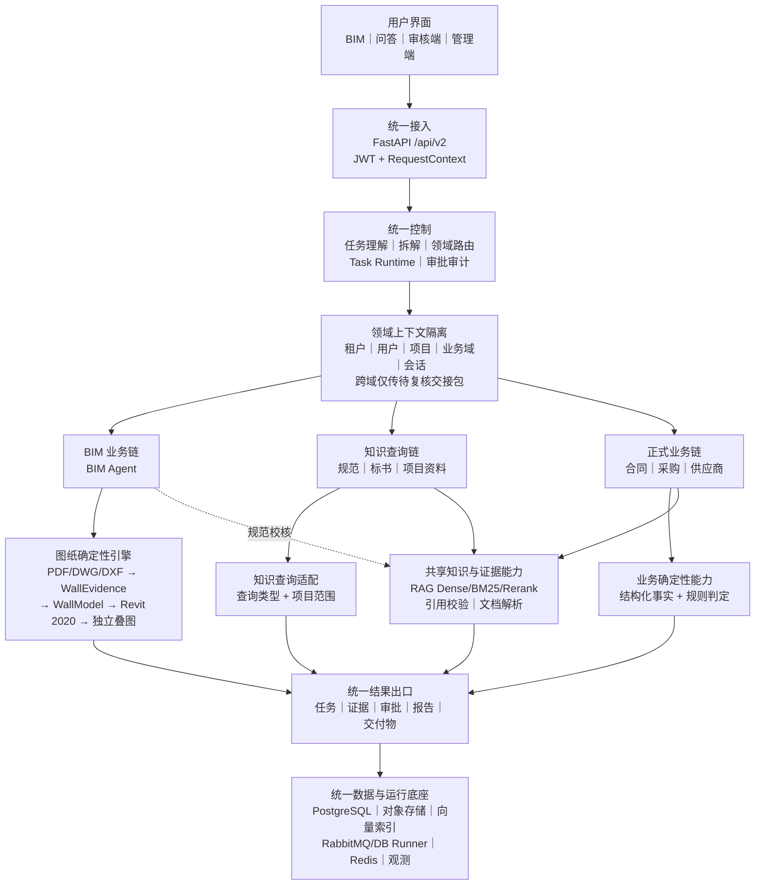

# BuildMate 架构总览

BIM 泛化路线见 [BIM 泛化设计](BIM_GENERALIZATION.md)。当前墙体流水线作为可审计的专业 profile 保留，通用内核、插件和目标编译器按该文档逐步落地。

**状态**：当前维护基线

**日期**：2026-09-06

本文只回答一个问题：BuildMate 各部分如何分工、如何连接。具体字段、接口和页面规则分别见 [总体设计](DESIGN.md)、[数据库设计](DATABASE_DESIGN.md)、[UI/UE 设计](UI_UX_DESIGN.md) 和模块设计文件。

## 1. 一句话架构

公共记忆能力已下沉到应用服务和数据库：各 Agent 复用同一套 scoped 历史/偏好接口，LangGraph 检查点只负责执行恢复；BIM 保留确定性引擎与审批边界。详见 [当前 Agent 记忆实现](AGENT_MEMORY.md)。

> 两个用户入口，经过一个受控入口层，进入两类业务处理：BIM 确定性建模链路，或问答驱动的知识/业务工作流；所有结果统一经过任务、证据、审批和审计。

## 2. 六层架构

| 层 | 只负责什么 | 不负责什么 |
|---|---|---|
| 体验层 | BIM、问答、审核端、管理端四类界面 | 不直接访问数据库、RAG 或 Revit |
| 接入层 | FastAPI `/api/v2`、JWT、租户/项目上下文、SSE | 不决定业务规则，不拼接业务 SQL |
| 控制层 | 任务理解、任务拆解、领域路由、Workflow Runtime、任务事件、审批和审计 | 不识别墙体，不生成未经注册的工具 |
| 业务层 | BIM Agent、知识问答、标书/合同/采购工作流 | 不直接写数据库，不直接调用 Revit API |
| 共享与专业能力层 | 文档解析、几何/规则、RAG 检索、结构化查询、Revit Bridge | 不由 LLM 决定几何、权限或事务 |
| 数据与运行层 | PostgreSQL、对象存储、向量索引、Redis、队列、观测 | 不承载用户界面和业务判断 |

## 3. 完整架构图



读图时只保留三条业务线：

1. **BIM**：`BIM → BIM Agent → 解析/几何 → 审批 → Revit Bridge → 独立叠图`。
2. **知识查询**：`问答 → 意图路由 → RAG → 引用式答案`。
3. **正式业务**：`问答 → 任务理解/拆解 → 合同/采购/谈判 Workflow → 共享 RAG + 结构化事实 + 规则 → 任务/审批/报告`。

共享 RAG 不属于某个业务 Agent。合同、采购、谈判和 BIM 规范校核都只能通过带 `RequestContext` 的 KnowledgeSearchRequest 访问；引用必须来自本次检索运行。

标书查询属于第二条或第三条：只定位资料时走知识查询，需要正式审查或报告时升级为任务。BIM 请求在问答中只做意图识别和入口跳转，不在聊天里直接写 Revit。

## 4. 三条链路的边界

### 4.1 BIM 建模链路

```text
用户上传 PDF/DWG/DXF
  → Artifact 校验与来源适配
  → SourceEntities / WallEvidence
  → 单位、坐标、轴网和墙柱几何
  → 去重、连接、墙厚、构件语义和 Model IR
  → Geometry Gate + WallModel 审批
  → Revit 轴网 → 墙柱写入
  → 读回 → 原图与 Revit 独立叠图
  → RVT、差异和审计报告
```

约束：LLM 只能帮助解释或补充语义，不能决定墙体坐标；Revit 只能读取已审批且哈希匹配的 WallModel。

### 4.2 知识查询链路

```text
自然语言问题
  → TaskPlan（单任务或复合任务）
  → IntentRoute / DomainRoute
  → 租户/项目/角色过滤
  → Dense + BM25 召回
  → Reranker
  → 证据过滤与引用校验
  → LLM 组织答案或拒答
```

建筑规范、标书定位、项目资料查询属于只读结果，不创建不可逆动作；每个答案必须能回到真实文档、版本和页码。

### 4.3 合同与采购链路

```text
自然语言请求 + 合同/采购资料
  → TaskPlan + 用户确认
  → IntentRoute
  → 创建持久化 Workflow
  → RAG：制度、条款、资质、历史资料
  → 结构化：金额、供应商、价格、预算、交付事实
  → 规则：阈值、合规、风险和权限
  → LLM：解释证据、归纳风险、生成待审摘要
  → Finding / Approval / Report
```

三类来源缺一不可：RAG 提供“依据”，结构化数据提供“事实”，规则引擎提供“判定”。LLM 不能替代任何一类来源。

### 4.4 复合任务与跨域交接

控制层只生成注册能力的计划，不直接执行业务：

```text
自然语言
  → Task Understanding
  → 单任务/复合任务判断
  → Task Decomposition（最多 20 步）
  → Domain Routing
  → 用户确认缺失参数和不可逆动作
  → Task Runtime
```

跨业务只传递结构化交接包，不传完整会话：

```json
{
  "schema_version": "1.0",
  "source_task": "contract-123",
  "target_domain": "negotiation",
  "tenant_id": "tenant-1",
  "project_id": "project-1",
  "actor_id": "user-1",
  "trace_id": "trace-1",
  "correlation_id": "correlation-1",
  "status": "draft",
  "requires_evidence_revalidation": true,
  "facts": {},
  "evidence_refs": [],
  "risk_summary": []
}
```

合同校验租户、项目和操作者，并拒绝已知历史/审批/凭证字段；当前只生成草稿，尚无自动跨域消费入口。未来消费时还必须核实源任务、证据访问权和事实内容；格式校验不等于证据真实性或敏感信息审查。

## 5. 统一任务与结果出口

所有正式工作流共用同一运行时，不再为每个 Agent 建一套任务系统：

```text
创建 TaskEnvelope
  → queued
  → running
  → waiting_human
  → resumed
  → succeeded / failed / canceled
```

统一输出四类结果：

| 结果 | 必须包含 |
|---|---|
| 查询答案 | 答案、引用、置信度、是否有据、检索运行 ID |
| 业务审核 | Finding、证据、规则版本、风险、审批记录 |
| BIM 交付 | WallModel、RVT、独立叠图、差异和审计报告 |
| 任务状态 | 当前步骤、事件游标、错误码、是否可重试、下一步动作 |

## 6. 依赖方向

```text
体验层
  ↓
API / 安全
  ↓
Application / Workflow Runtime
  ↓
Domain + Ports
  ↓
Adapters（数据库、队列、RAG、对象存储、Revit Bridge）
```

- `api` 不直接写业务 SQL。
- `agents` 不直接访问数据库或 Revit。
- `rag` 不拥有权限事实，权限来自 PostgreSQL 的租户/项目过滤。
- `Revit Bridge` 不负责登录、审批或跨项目读取。
- `LLM` 不生成工具名、SQL、文件路径或 Revit 脚本。

## 7. 模块如何归并

现有 M01–M18 保留为实现文档，但在架构上只归入六个系统域：

| 系统域 | 包含模块 | 用户理解方式 |
|---|---|---|
| 平台基础 | M01–M04、M17–M18 | 登录、项目、文件、任务、运维和质量 |
| 受控入口 | M05、M08 | 问答如何判断并选择能力 |
| 知识与业务 | M06、M09–M11 | RAG、标书、合同、采购 |
| BIM 交付 | M07 | 图纸到 Revit 的唯一主链 |
| 人工治理 | M12–M13、M16 | 审核、审批、证据和审计 |
| 产品界面 | M14–M15 | 用户看到的 BIM、问答、审核和管理端 |

因此“Agent 数量”不再是架构主线；主线是 **入口 → 路由/工作流 → 确定性能力 → 任务/审批 → 交付**。

## 8. 当前实现边界

- 普通业务入口收敛为 `/qa` 智能工作台与 `/bim` BIM Agent。投标审查、采购审批、供应商谈判作为工作台内部面板复用原有业务接口，不再占用独立侧边栏入口。
- 智能对话的业务路由输出 `capability`，由前端展示相应面板；提交前仍需补齐业务参数并明确确认，意图识别本身不会提交采购或审批。
- 历史 `/bid-review`、`/procurement`、`/negotiation` 链接跳转至对应工作台面板；不删除仍在使用的领域代码、审批权限和业务 API。
- 工作台内各能力仍按 `tenant/user/project/agent/session` 隔离记忆；问答历史不自动注入投标、采购或谈判任务。审核中心、管理端知识库和任务时间线保留角色限制。
- 已实现：`IntentRoute`、确定性意图路由、`TaskPlan` 单/复合任务预览、`POST /api/v2/chat/intents/preview` 和 `POST /api/v2/chat/tasks/preview`。
- 已实现：明确业务/复合请求通过现有聊天 SSE 输出同一套 `TaskPlan`，跳过第二次 LLM 路由。计划卡展示中文步骤、缺参及“尚未执行”，可恢复历史；复合计划确认后调用持久化父子任务接口。
- 已实现：`TaskHandoffPackage` 草稿合同和租户/项目/操作者校验；它只描述交接，不校验源任务所有权或证据真实内容，不自动创建任务或绕过目标域审批。
- 已实现：RAG Service 已作为共享检索/引用实现，QA、聊天接口 和知识 API 使用同一套 `KnowledgeSearchRequest` / `RAGAnswer` 合同。
- 已保留：BIM 独立入口及原有 WallEvidence/WallModel/Revit 2020 主链路。
- 已确定：合同和采购工作流都必须同时记录 RAG、结构化事实和规则来源。
- 当前复合计划仍需要用户明确确认；确认后由持久化服务创建父任务、子任务和交接包，子任务分别执行并保留独立审批记录。
- 合同预审 Workflow 已注册并在证据不足时暂停人工审核；跨域自动串联仍要求每个子任务通过各自的权限、证据和审批门禁。

入口合并不等于跳过领域门禁：工作台复用投标、采购和谈判接口，合同预审使用统一任务运行时，所有结果都必须经过各自的证据和审批校验。

本文的架构图描述的是目标与边界；“当前实现边界”单独列出，避免把设计图误认为已经全部上线。
